# Campus Drop — Database ERD

PostgreSQL 스키마는 Prisma로 정의되어 있습니다. 아래 ERD는 [campusdrop_server/prisma/schema.prisma](../campusdrop_server/prisma/schema.prisma)를 기준으로 하며, **상세 필드·인덱스·제약은 해당 파일을 참고**하세요.

**유지보수**: `schema.prisma`를 변경한 경우 이 문서의 Mermaid 다이어그램도 함께 맞춰 주세요.

## ERD — 코어 도메인

매칭·유저당 후기는 `(matching_id, identity_id)` 유니크로 사실상 **매칭↔참가자 연결(속성 있는 연관)** 형태입니다. 조인 엔티티로 N:M을 풀지 않은 설계입니다.

```mermaid
erDiagram
  %% Table: identities — 계정·로그인 식별(OAuth, 이메일, 학교 인증·운영 필드)
  Identity {
    UUID id PK "사용자 고유 식별자"
    TEXT nickname UK "표시용 닉네임(자동 생성, NULL 허용·UNIQUE)"
    TEXT email UK "정규화 학교 이메일(@sju.ac.kr), 미인증 시 NULL"
    TEXT kakaoId UK "카카오 OAuth 사용자 ID"
    TEXT kakao_refresh_token "카카오 리프레시 토큰(알림·갱신용, 선택)"
    TEXT kakao_link_pin UK "챗봇 연동 4자리 PIN(UNIQUE, 연동 후 NULL)"
    timestamp blocked_at "관리자 차단 시각(NULL=정상)"
    timestamp school_proof_verified_at "학교 증빙 승인 시각"
    timestamp image_uuid_access_until "익명 UUID 온보딩 접근 만료(이메일 연동 시 NULL)"
    TEXT student_id "학번(설문 프로필 동기화·운영용)"
    TEXT birth_year "출생연도(설문 동기화)"
    TEXT department "학과(선택)"
    TEXT phone_encrypted "휴대폰 AES-GCM 암호문"
    BOOLEAN privacy_policy_agreed "개인정보 처리방침 동의 여부"
    TEXT meeting_time "만남 일정 라벨(알림 파싱용)"
    TEXT meeting_place "만남 장소 라벨(알림 표기용)"
    TEXT acquisition_source "유입 경로 slug(everytime|instagram|friend|poster)"
    timestamp createdAt "계정 생성 일시"
  }

  %% Table: traits — 성향·설문 스냅샷(1:1 Identity, id 공유)
  Trait {
    UUID id PK "PK·identities.id와 동일(UUID), FK 동일키 1:1"
    TEXT gender "male 또는 female 등(이성 매칭용)"
    JSONB surveyData "로맨스 설문 JSON 전체"
    JSONB friend_survey_data "친구 설문 JSON 전체"
    timestamp survey_submitted_at "로맨스 설문 제출 시각 갱신"
    timestamp friend_survey_submitted_at "친구 설문 제출 시각 갱신"
    timestamp updatedAt "행 수정 시각"
  }

  %% Table: weekly_survey_submissions — 로맨스 주차별 설문 스냅샷(레거시 테이블명)
  WeeklySurveySubmission {
    UUID id PK "행 식별자"
    UUID identity_id FK "제출자 identities.id"
    timestamp target_period_start "해당 매칭 주 시작 앵커"
    timestamp target_period_end "해당 매칭 주 종료"
    TEXT gender "제출 시점 성별 스냅샷"
    JSONB survey_data "해당 주 제출 설문 JSON"
    timestamp submitted_at "실제 제출 시각"
    timestamp created_at "행 생성"
    timestamp updated_at "행 수정"
  }

  %% Table: friend_weekly_survey_submissions — 친구 매칭 주차별 설문 스냅샷
  FriendWeeklySurveySubmission {
    UUID id PK "행 식별자"
    UUID identity_id FK "제출자 identities.id"
    timestamp target_period_start "해당 매칭 주 시작 앵커"
    timestamp target_period_end "해당 매칭 주 종료"
    TEXT gender "제출 시점 성별 스냅샷"
    JSONB survey_data "해당 주 제출 설문 JSON"
    timestamp submitted_at "실제 제출 시각"
    timestamp created_at "행 생성"
    timestamp updated_at "행 수정"
  }

  %% Table: cafes — 만남 장소(카페) 마스터, 배치 시 라운드로빈 배정
  Cafe {
    UUID id PK "카페 식별자"
    TEXT name UK "사용자 노출 이름(UNIQUE)"
    TEXT naver_place_url "네이버 장소 URL(선택)"
    TEXT address "운영용 주소 메모(선택)"
    BOOLEAN is_active "배치 대상 여부(false면 신규 배정 제외)"
    INTEGER display_order "라운드로빈 순서"
    timestamp created_at "생성 일시"
    timestamp updated_at "수정 일시"
  }

  %% Table: matchings — 매칭 1행=유저 쌍(A,B), 로맨스/친구 구분·점수·약속·카페
  Matching {
    UUID id PK "매칭 행 식별자"
    UUID user_a_id FK "쌍의 첫 번째 identities.id"
    UUID user_b_id FK "쌍의 두 번째 identities.id"
    TEXT match_type "ROMANCE 또는 FRIEND"
    FLOAT score "매칭 알고리즘 점수(PostgreSQL DOUBLE PRECISION)"
    timestamp matched_at "매칭 확정 시각"
    timestamp period_start "주간 버킷 시작(NULL 가능)"
    JSONB match_report "배치 리포트 스냅샷(선택)"
    timestamp meeting_starts_at "약속 시작 시각(QR 채팅용)"
    TEXT meeting_venue_name "당시 장소명 스냅샷"
    UUID cafe_id FK "배정 카페(NULL 허용, 카페 삭제 시 SET NULL)"
    timestamp feedback_friend_talk_sent_at "만남 후기 친구톡 발송 시각(중복 방지)"
  }

  %% Table: matching_friend_talk_rsvps — 일정/전날 친구톡 RSVP·전화번호(매칭당 1행)
  MatchingFriendTalkRsvp {
    UUID matching_id PK "PK·matchings.id FK(매칭당 1행)"
    TEXT phone_user_a "Solapi 발신용 A 전화번호"
    TEXT phone_user_b "Solapi 발신용 B 전화번호"
    TEXT monday_rsvp_user_a "7번 일정 안내 YES 또는 NO"
    TEXT monday_rsvp_user_b "7번 일정 안내 YES 또는 NO"
    TEXT day_eve_rsvp_user_a "6번 전날 YES 또는 NO(레거시 필드)"
    TEXT day_eve_rsvp_user_b "6번 전날 YES 또는 NO(레거시 필드)"
    BOOLEAN skip_day_eve_reminder "한쪽 NO 시 전날 알림 생략"
    BOOLEAN monday_outcome_sent "7번 후속 확정/취소 톡 발송 여부"
    TEXT monday_outcome "CONFIRMED 또는 CANCELLED"
    timestamp monday_outcome_sent_at "후속 톡 발송 시각"
    BOOLEAN day_eve_outcome_sent "전날 후속 발송 플래그(미사용)"
    timestamp day_eve_reminder_sent_at "전날 리마인드 발송 시각"
    timestamp updated_at "수정 시각"
  }

  %% Table: matching_meeting_feedbacks — 만남 당일 후기(매칭·유저당 1행)
  MatchingMeetingFeedback {
    UUID id PK "피드백 행 식별자"
    UUID matching_id FK "대상 matchings.id"
    UUID identity_id FK "응답자 identities.id"
    TEXT choice "similar, different, neutral 중 하나"
    timestamp created_at "응답 생성"
  }

  %% Table: meeting_chat_messages — 소개팅 QR 채팅 메시지(감사 보존)
  MeetingChatMessage {
    UUID id PK "메시지 식별자"
    UUID matching_id FK "소속 matchings.id"
    UUID sender_id FK "발신 identities.id"
    TEXT body "본문"
    timestamp created_at "전송 시각"
  }

  %% Table: school_proof_submissions — 학교 증빙 이미지 제출(검수 워크플로)
  SchoolProofSubmission {
    UUID id PK "제출 건 식별자"
    UUID identity_id FK "제출자 identities.id"
    TEXT stored_path "서버 저장 상대 경로"
    TEXT mime_type "MIME 타입"
    INTEGER file_size "바이트 크기"
    TEXT status "pending, approved, rejected"
    timestamp reviewed_at "검수 시각"
    UUID reviewer_admin_id "검수 관리자 UUID(논리 FK→admins, Prisma 관계 없음)"
    timestamp created_at "제출 생성"
  }

  Identity ||--o| Trait : "has_profile (1:1 동일 PK/FK)"
  Identity ||--o{ WeeklySurveySubmission : "submits_romance_weekly (1:N)"
  Identity ||--o{ FriendWeeklySurveySubmission : "submits_friend_weekly (1:N)"
  Identity ||--o{ SchoolProofSubmission : "uploads_school_proof (1:N)"

  Identity ||--o{ Matching : "paired_as_user_a (1:N)"
  Identity ||--o{ Matching : "paired_as_user_b (1:N)"

  Cafe ||--o{ Matching : "hosts_meetings (1:N, cafe_id NULL 가능)"

  Matching ||--|| MatchingFriendTalkRsvp : "has_rsvp_row (1:1)"
  Matching ||--o{ MeetingChatMessage : "has_chat (1:N)"
  Matching ||--o{ MatchingMeetingFeedback : "collects_feedback (1:N)"

  Identity ||--o{ MatchingMeetingFeedback : "gives_feedback (1:N)"
  MeetingChatMessage }o--|| Identity : "sent_by (N:1)"
```

## ERD — 운영 · 분석 · 기타

`FriendTalkRsvpLink`, Analytics 테이블, `SchoolProofSubmission.reviewer_admin_id`는 Prisma에 `@relation`이 없거나 문자열 UUID만 두는 필드입니다. 아래 관계선은 **도메인상의 논리 참조**를 나타냅니다. `AccessLog`, `Admin`, `LandingLikeCounter`는 다른 테이블과 Prisma 관계가 없어 **동일 다이어그램에서 엔티티 정의와 논리선**으로만 연결됩니다.

```mermaid
erDiagram
  %% Table: admins — 관리자 콘솔 계정(일반 Identity와 분리)
  Admin {
    UUID id PK "관리자 식별자"
    TEXT email UK "로그인 이메일(정규화, UNIQUE)"
    TEXT password_hash "비밀번호 해시"
    timestamp createdAt "생성 일시"
    timestamp updatedAt "수정 일시"
  }

  %% Table: access_logs — 감사·특권 접근 로그(append-only)
  AccessLog {
    UUID id PK "로그 식별자"
    TEXT actorType "user_session, system, admin, job 등"
    TEXT actorId "행위자 불투명 ID(선택)"
    TEXT action "이벤트 코드(예: TRAIT_UPDATE)"
    TEXT resource "리소스 키(원문 PII 금지)"
    TEXT ip "클라이언트 IP"
    TEXT userAgent "User-Agent 문자열"
    JSONB metadata "부가 구조화 필드"
    timestamp createdAt "기록 시각"
  }

  %% Table: friend_talk_rsvp_links — 친구톡 버튼 URL 단축 링크
  FriendTalkRsvpLink {
    TEXT code PK "단축 코드"
    UUID matching_id "연결 matchings.id(논리 FK, NULL 허용)"
    UUID identity_id "클릭 주체 identities.id(논리 FK)"
    TEXT phase "RSVP 단계 식별"
    TEXT choice "버튼 선택값"
    timestamp expires_at "만료"
    timestamp created_at "생성"
  }

  %% Table: analytics_events — 클라이언트 분석 이벤트(append-only)
  AnalyticsEvent {
    UUID id PK "이벤트 행 ID"
    UUID session_id "세션 UUID"
    UUID user_uuid "Identity.id 스냅샷(논리 FK, NULL 허용)"
    TEXT app "앱 식별자"
    TEXT release "릴리스 버전"
    timestamp client_ts "클라이언트 시각"
    TEXT name "이벤트 이름"
    timestamp event_ts "이벤트 시각"
    JSONB props "속성 JSON"
    UUID client_event_id "멱등/중복 제거용(선택)"
    timestamp received_at "서버 수신"
  }

  %% Table: analytics_session_heartbeats — 세션 하트비트 UPSERT
  AnalyticsSessionHeartbeat {
    UUID session_id PK "세션 UUID"
    UUID user_uuid "Identity.id(논리 FK, NULL 허용)"
    timestamp last_meaningful_activity_at "최근 의미 있는 활동 시각"
    TEXT visibility "가시성 상태(선택)"
    JSONB context "컨텍스트 JSON"
    timestamp client_ts "클라이언트 시각"
    timestamp updated_at "갱신 시각"
  }

  %% Table: analytics_interactions — dead click 등 고밀도 상호작용
  AnalyticsInteraction {
    UUID id PK "상호작용 ID"
    UUID session_id "세션 UUID"
    UUID user_uuid "Identity.id(논리 FK, NULL 허용)"
    TEXT type "상호작용 유형"
    timestamp ts "발생 시각"
    FLOAT x_norm "정규화 X 좌표(PostgreSQL DOUBLE PRECISION)"
    FLOAT y_norm "정규화 Y 좌표(PostgreSQL DOUBLE PRECISION)"
    TEXT nearest_region "가장 가까운 UI 영역"
    TEXT view "화면 식별자"
    timestamp received_at "서버 수신"
  }

  %% Table: analytics_session_user_links — session_id와 user_uuid 연결
  AnalyticsSessionUserLink {
    UUID session_id PK "세션 UUID"
    UUID user_uuid "Identity.id(논리 FK)"
    timestamp updated_at "갱신 시각"
  }

  %% Table: landing_like_counters — 랜딩 더블탭 좋아요 합계(키당 1행)
  LandingLikeCounter {
    TEXT key PK "카운터 키(예: default)"
    INTEGER like_count "좋아요 수"
    timestamp updated_at "갱신 시각"
  }

  Identity {
    UUID id PK "논리 연결용(참조만)"
  }
  Matching {
    UUID id PK "논리 연결용(참조만)"
  }
  SchoolProofSubmission {
    UUID id PK "논리 연결용"
    UUID reviewer_admin_id "admins.id 논리 FK"
  }

  FriendTalkRsvpLink }o--o| Identity : "logical identity_id"
  FriendTalkRsvpLink }o--o| Matching : "logical matching_id"
  AnalyticsEvent }o--o| Identity : "logical user_uuid"
  AnalyticsSessionHeartbeat }o--o| Identity : "logical user_uuid"
  AnalyticsInteraction }o--o| Identity : "logical user_uuid"
  AnalyticsSessionUserLink }o--|| Identity : "logical user_uuid"
  SchoolProofSubmission }o--o| Admin : "logical reviewer_admin_id"
```

