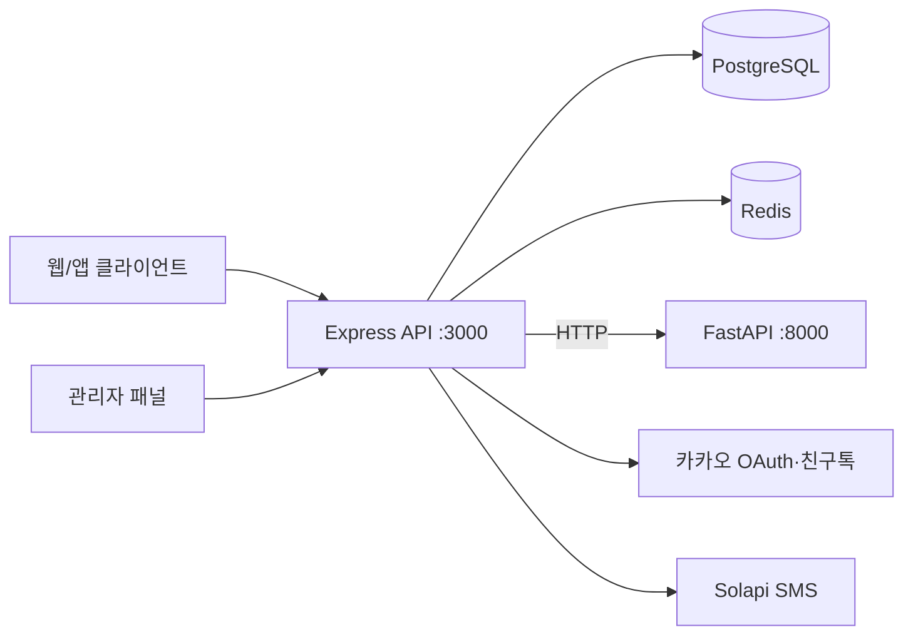

# Campus Drop Backend

> 세종대학교 재학생 대상 **캠퍼스 기반 오프라인 만남 매칭** 서비스의 API 서버

2026년 4월 세종대학교 캠퍼스에서 약 1개월간 MVP를 운영한 **Campus Drop(캠퍼스드랍)** 의 백엔드입니다.  
대학 이메일·증빙으로 신원을 확인하고, 가치관·라이프스타일 설문으로 상대를 추천하며, 제휴 카페 오프라인 소개팅과 QR 채팅까지 **가입 → 매칭 → 만남 → 사후 연결** 전 과정을 지원합니다.

참여자·관리자 **프론트엔드**는 별도 저장소에서 관리합니다.

---

## 한눈에 보기

| 항목 | 내용 |
|------|------|
| 타겟 | 세종대학교 재학생 (`@sju.ac.kr`) |
| MVP 기간 | 2026년 4월 · 약 1개월 |
| MVP 성과 | 가입 약 300명 · 매칭 67쌍(134명) · 제휴 카페 오프라인 만남 |
| 현재 상태 | MVP 검증 완료 · 새 아이템 피봇 준비 중 (코드베이스 보존) |
| 이 저장소 | Express API · Prisma · Python 매칭 · Docker Compose |

---

## 서비스 정의

**Campus Drop**은 “같은 학교 사람끼리, 설문으로 맞춰 보고, 카페에서 실제로 만나자”는 가설로 만든 **대학생 전용 만남 플랫폼**입니다.

### 핵심 기능

| 기능 | 설명 |
|------|------|
| 대학 인증 | `@sju.ac.kr` 이메일 인증, 학교 증빙 이미지·관리자 심사, 카카오 OAuth |
| 설문 매칭 | 가치관·라이프스타일·만남 가능 시간 기반 추천 |
| 연인 매칭 | 1:1 · Python 매칭 엔진 · 주간 배치 |
| 친구 매칭 | 3~4명 소그룹 · Node.js 그룹핑 · 주간 배치 |
| 오프라인 연계 | 제휴 카페 라운드로빈 배정, 약속 시간·장소 |
| 알림 | 카카오 친구톡 — 매칭 성공, RSVP, 전날 리마인드, 만남 후기 |
| 만남 채팅 | QR·링크 입장, 매칭 후 익명 채팅 |
| 축제 매칭 | 단기 이벤트 신청·슬롯·관리자 라운드 |
| 운영 | 관리자 콘솔 API — 배치 실행, 카페·사용자·증빙 관리 |

### 사용자 플로우

```
랜딩 → 연인/친구 선택 → 만남 시간 선택 → 인증·프로필 → 설문 → 매칭 대기 → 카페 만남 → QR 채팅
```

---

## 아키텍처



| 구성요소 | 경로 | 역할 |
|----------|------|------|
| **Node API** | `campusdrop_server/` | REST API, 인증, 배치, 알림, Prisma ORM |
| **Python 매칭** | `campusdrop_matching/` | 연인 1:1 호환도 점수 · `/calculate-match`, `/batch-match` |
| **PostgreSQL** | Docker `db` | 영속 데이터 |
| **Redis** | Docker `redis` | 레이트리밋, 캐시 |

### 매칭 레인

| 타입 | 방식 | 엔진 |
|------|------|------|
| `ROMANCE` | 1:1 쌍 | Python `batch-match` → DB `matchings` |
| `FRIEND` | 3~4명 소그룹 | Node `friendGroupWeeklyBatch` → `friend_groups` |

---

## 기술 스택

| 구분 | 기술 |
|------|------|
| API | Node.js, Express 5 |
| ORM | Prisma 6, PostgreSQL 15 |
| 캐시 | Redis 7 |
| 매칭 | Python 3, FastAPI, NumPy |
| 인증 | 카카오 OAuth, 이메일 인증 코드, Admin JWT |
| 알림 | Solapi 친구톡, AWS SES/SMTP |
| 문서 | Swagger UI (`/api-docs`), OpenAPI (`/openapi.json`) |
| 배포 | Docker Compose |
| 테스트 | Node `node:test`, Python pytest |

---

## 프로젝트 구조

```
campusdrop_v1_backend/
├── campusdrop_server/       # Express API
│   ├── index.js             # 진입점 · 라우트 · cron
│   ├── routes/              # HTTP 라우터
│   ├── lib/                 # 도메인 로직
│   ├── prisma/              # 스키마 · 마이그레이션
│   └── test/                # 단위 테스트
├── campusdrop_matching/     # Python 매칭 서비스
│   └── app/
│       ├── main.py
│       ├── matching.py
│       └── batch_match.py
├── config/                  # 설문 시맨틱스 JSON
├── docs/                    # API 명세 · ERD
├── docker-compose.yml
├── Dockerfile.server
└── .env.example
```

---

## 빠른 시작

### 1. 환경 변수

```bash
cp .env.example .env
# DATABASE_URL, SMTP, 카카오, ADMIN_* 등 수정
```

### 2. Docker Compose (권장)

```bash
# API + DB + Redis
docker compose up -d --build server

# 로맨스 매칭 배치까지 필요할 때
docker compose --profile matching up -d --build
```

컨테이너 기동 시 `entrypoint.server.sh`가 `prisma migrate deploy` 후 Node를 실행합니다.

프로덕 갱신:

```bash
git pull origin main && docker compose up -d --build server
```

### 3. 로컬 개발 (Node만)

```bash
# DB·Redis는 Compose로 띄운 뒤
cd campusdrop_server
npm install
npm run dev
```

| 스크립트 | 설명 |
|----------|------|
| `npm run dev` | nodemon 개발 서버 |
| `npm start` | 프로덕션 실행 |
| `npm test` | 단위 테스트 |
| `npm run db:migrate` | Prisma migrate dev |
| `npm run db:studio` | Prisma Studio |
| `npm run admin:upsert` | `.env` 관리자 계정 upsert |
| `npm run smoke` | API 스모크 테스트 |

기본 포트: **3000** · Swagger: `http://localhost:3000/api-docs`

---

## API 개요

| 경로 prefix | 용도 |
|-------------|------|
| `/api/auth` | 이메일 인증, 카카오 OAuth, 프로필 |
| `/api/survey` | 로맨스·친구 설문 제출 |
| `/api/match` | 매칭 상태, 점수 계산 |
| `/api/meet-chat` | QR 채팅 |
| `/api/friend-talk` | 친구톡 RSVP 콜백 |
| `/api/festival` | 축제 매칭 |
| `/api/admin` | 관리자 — 배치, 카페, 증빙 심사 |
| `/api/analytics` | 클라이언트 분석 이벤트 |

### 인증

- **참여자**: `x-user-uuid` 헤더 = `Identity.id` (프론트는 `userUuid` 쿠키 → 헤더 변환)
- **관리자**: `Authorization: Bearer <JWT>` (`POST /api/admin/login`)

상세 명세: [docs/API.md](./docs/API.md)

---

## 백그라운드 작업

서버 기동 시 등록되는 cron (환경 변수로 개별 비활성화 가능):

- 매칭 성공 친구톡 발송
- 월요일 RSVP·전날 리마인드
- 만남 후기 친구톡
- 친구 그룹 출석 마감·예약 발송
- 휴대폰 미등록 계정 정리

---

## 데이터베이스

PostgreSQL 스키마는 Prisma로 관리합니다.

- 스키마: [campusdrop_server/prisma/schema.prisma](./campusdrop_server/prisma/schema.prisma)
- ERD: [docs/ERD.md](./docs/ERD.md)

---

## 관련 문서

| 문서 | 설명 |
|------|------|
| [docs/API.md](./docs/API.md) | HTTP API 전체 명세 |
| [docs/ERD.md](./docs/ERD.md) | Mermaid ERD |
| [docs/FRONTEND_LANDING_LIKE_API.md](./docs/FRONTEND_LANDING_LIKE_API.md) | 랜딩 좋아요 API |
| `.env.example` | 환경 변수 목록·설명 |

---

## MVP에서 배운 점

MVP 이후 **소개팅 단일 모델만으로는 사업화가 어렵다**고 판단했습니다. 기존 사용자는 유지되지만 **여성 신규 유입**이 부족해 매칭 풀·성비 균형 유지가 어려웠고, 이를 바탕으로 새 아이템 피봇을 준비 중입니다.

이 저장소는 MVP 단계의 **기술·운영 자산**으로 보존합니다.

---

## 라이선스

세종대학교 PBL 과정 팀 프로젝트 · MIT (see `campusdrop_server/package.json`)
